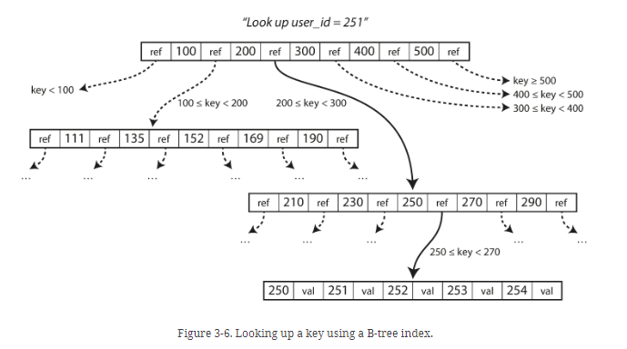
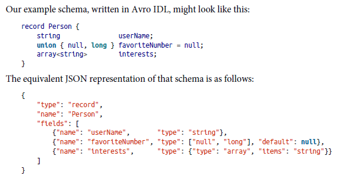
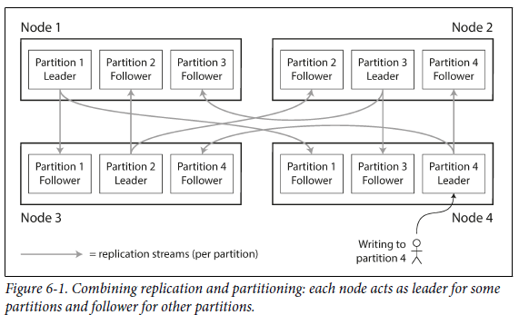

# Designing Data Intensive Applications

- [Reliable, Scalable and Maintainable Applications](#reliable-scalable-and-maintainable-applications)
  - [Reliability](#reliability)
  - [Scalability](#scalability)
  - [Maintainability](#maintainability)
- [Data Models and Query Languages](#data-models-and-query-languages)
  - [Relational Model vs Document Model](#relational-model-vs-document-model)
  - [Query Languages for Data](#query-languages-for-data)
  - [Graph-Like Data Models](#graph-like-data-models)
- [Storage and Retrieval](#storage-and-retrieval)
  - [Data Structures That Power Your Database](#data-structures-that-power-your-database)
  - [Transaction Processing or Analytics?](#transaction-processing-or-analytics)
  - [Column-Oriented Storage](#column-oriented-storage)
- [Encoding and Evolution](#encoding-and-evolution)
  - [Formats for Encoding Data](#formats-for-encoding-data)
  - [Modes of Dataflow](#modes-of-dataflow)
- [Replication](#replication)
  - [Leader and Followers](#leader-and-followers)
  - [Multi-Leader Replication](#multi-leader-replication)
  - [Leaderless Replication](#leaderless-replication)
- [Partitioning](#partitioning)
  - [Partitioning and Replication](#partitioning-and-replication)
  - [Partitioning of Key-Value Data](#partitioning-of-key-value-data)
  - [Partitioning and Secondary Indexes](#partitioning-and-secondary-indexes)
  - [Rebalancing Partitions](#rebalancing-partitions)
  - [Request Routing](#request-routing)
- [Transactions](#transactions)
  - [The Slippery Concept of a Transaction](#the-slippery-concept-of-a-transaction)
  - [Weak Isolation Levels](#weak-isolation-levels)

## Reliable, Scalable and Maintainable Applications

A data-intensive application is typically built from standard building blocks that provide commonly needed functionality. For example, many applications need to:

- Store data so that they, or another application, can find it again later (databases)
- Remember the result of an expensive operation, to speed up reads (caches)
- Allow users to search data by keyword or filter it in various ways (search indexes)
- Send a message to another process, to be handled asynchronously (stream processing)
- Periodically crunch a large amount of accumulated data (batch processing)

### Reliability

The system should continue to work correctly (performing the correct function at the desired level of performance) even in the face of adversity (hardware or software faults, and even human error).

- The application performs the function that the user expected.
- It can tolerate the user making mistakes or using the software in unexpected ways.
- Its performance is good enough for the required use case, under the expetcted load and data volume.
- The system prevents any unauthorized access and abuse.

The things that can go wrong are called faults, and systems that anticipate faults and can cope with them are called fault-tolerant or resilient.
A fault is usually defined as one component of the system deviating from its spec, whereas a failure is when the system as a whole stops providing the required service to the user.

Types of Faults:

- **Hardware Faults** - Hard disks crash, RAM becomes faulty, the power grid has a blackout, someone unplugs the wrong network cable.
- **Software Errors** - The bugs that cause these kinds of software faults often lie dormant for a long time until they are triggered by an unusual set of circumstances. In those circumstances, it is revealed that the software is making some kind of assumption about its environment—and while that assumption is usually true, it eventually stops being true for some reason.
- **Human Errors** - Ways to prevent human errors:
  1. Design systems in a way that minimizes opportunities for error (using well-defined abstractions, APIs, etc.)
  2. Decouple the places where people make the most mistakes from the places where they can cause failures (like having staging environments)
  3. Test thoroughly
  4. Allow quick and easy recovery from human errors, to minimize the impact in the case of a failure.
  5. Set up detailed and clear monitoring, such as performance metrics and error rates.

### Scalability

As the system grows (in data volume, traffic volume, or complexity), there should be reasonable ways of dealing with that growth.

**Load** - Load can be described with a few numbers which we call load parameters. The best choice of parameters depends on the architecture of your system: it may be requests per second to a web server, the ratio of reads to writes in a database, the number of simultaneously active users in a chat room, the hit rate on a cache, or something else.

**Performance** - Performance of a system depends on the type of system. In online systems, what’s usually more important is the service’s response time—that is, the time between a client sending a request and receiving a response.

> Latency and response time are often used synonymously, but they are not the same. The response time is what the client sees: besides the actual time to process the request (the service time), it includes network delays and queueing delays. Latency is the duration that a request is waiting to be handled—during which it is latent, awaiting service.

Percentiles are a better metric than average response time to gauge the performance of a system. Percentiles are often used in _service level objectives (SLOs)_ and _service level agreements (SLAs)_, contracts that define the expected performance and availability of a service.

### Maintainability

Over time, many different people will work on the system (engineering and operations, both maintaining current behavior and adapting the system to new use cases), and they should all be able to work on it productively.

However, we can and should design software in such a way that it will hopefully minimize pain during maintenance, and thus avoid creating legacy software ourselves. To this end, we will pay particular attention to three design principles for software systems:

- Operability - Make it easy for operations teams to keep the system running smoothly.
- Simplicity - Make it easy for new engineers to understand the system, by removing as much complexity as possible from the system.
- Evolvability - Make it easy for engineers to make changes to the system in the future, adapting it for unanticipated use cases as requirements change. Also known as _extensibility_, _modifiability_, or _plasticity_.

## Data Models and Query Languages

A data model is an abstract model that organizes elements of data and standardizes how they relate to one another and to the properties of real-world entities.

### Relational Model vs Document Model

The roots of relational databases lie in _business data processing_. However, even for the more powerful and networked computers today, relational databases generalized very well.

Driving forces behind NoSQL adoption:

- need for greater scalability
- preference for free and open-source software
- specialized query operations
- restrictiveness of relational schemas

Most application development today is done in object-oriented programming languages, which leads to a common criticism of the SQL data model: if data is stored in relational tables, an awkward translation layer is required between the objects in the application code and the database model of tables, rows, and columns. The disconnect between the models is sometimes called an impedance mismatch. Some developers feel like the JSON model reduces this impedance mismatch.

When it comes to representing many-to-one and many-to-many relationships, relational and document databases are not fundamentally different. In both cases, the related item is referenced by a unique identifier, which is called a _foreign key_ in the relational model and a _document reference_ in the document model.

#### Which data model leads to simpler application code?

- if the data in the application is in the form of a tree of one-to-many relationships, where typically the entire tree is loaded at once, then it's a good idea to use a document model. The relational technique of splitting a document-like structure into multiple tables can lead to cumbersome schema and unnecessarily cumbersome code.
- document databases have poor support for joins. This might not be a problem in analytics applications in which many-to-many relationships are never needed to record the time at which events occur.
- if application uses many-to-many relationships, the document model can lead to more complex code and worse performance.
- for highly interconnected data, the relational model is more acceptable

#### Schema flexibility in document model

Most document databases do not enforce any schema on the data in documents. Document databases are sometimes called schemaless, but that’s misleading, as the code that reads the data usually assumes some kind of structure—i.e., there is an implicit schema, but it is not enforced by the database.

If the schema has to be changed, in document models, we could simply start writing new data in the new schema format. However, in relational schema, a migration might have to be performed.

### Query Languages for Data

SQL is a _declarative_ query language whereas most commonly used programming languages are imperative. An imperative language tells the computer to perform certain operations in a certain order. On the other hand, in a declarative query language, you just specify the pattern of the data you want—what conditions the results must meet, and how you want the data to be transformed (e.g., sorted, grouped, and aggregated)—but not how to achieve that goal.

Imperative code is very hard to parallelize across multiple cores and multiple machines, because it specifies instructions that must be performed in a particular order. Declarative languages have a better chance of getting faster in parallel execution because they specify only the pattern of the results, not the algorithm that is used to determine the results.

The advantages of declarative query languages are not limited to just databases. They can be seen in a web browser. Imagine having to set the background-color to a particular selector in CSS `li.selected > p`. It is fairly straighforward since it is a declarative approach. Imagine having to imperatively using JS to set the color. The code for the same would look awful.

### Graph-Like Data Models

If our application mostly has mostly one-to-many relationships or no relationships, it makes more sense to use a document model. However, if many-to-many relationships are common in our application, then the data becomes too complex for a relational model and we can start modelling the data as a graph.

#### Property Graphs

Each vertex consists of:

- a unique identifier
- a set of incoming edges
- a set of outgoing edges
- a collection of key-value pairs

Each edge consists of:

- a unique identifier
- vertex at which the edge starts (tail vertex)
- vertex at which the edge ends (head vertex)
- a label to describe the kind of relationship
- a collection of key-value pairs

Representing a property graph using a relational schema:

```sql
CREATE TABLE vertices (
    vertex_id   integer PRIMARY KEY,
    properties  json
);

CREATE TABLE edges (
    edge_id     integer PRIMARY KEY,
    tail_vertex integer REFERENCES vertices (vertex_id),
    head_vertex integer REFERENCES vertices (vertex_id),
    label       text,
    properties  json
);

CREATE INDEX edges_tails ON edges (tail_vertex);
CREATE INDEX edges_heads ON edges (head_vertex);
```

#### Graph Queries in SQL

The above example suggests that graph data can be represented in a relational database. We can also query this graph data in a relational structure, but with some difficulty.

In a relational database, you usually know in advance which joins you need in your query. In a graph query, you may need to traverse a variable number of edges before you find the vertex you’re looking for—that is, the number of joins is not fixed in advance.

#### Triple Stores

Triple Store model is mostly equivalent to the property graph model. In a triple-store, all information is stored in the form of very simple three-part statements: (subject, predicate, object).

- Subject -> vertex
- Object -> a value in primitive datatype OR another vertex

## Storage and Retrieval

### Data Structures That Power Your Database

Consider the world's simplest database implemented using just 2 Bash functions.

```bash
#!/bin/bash

db_set () {
    echo "$1,$2" >> database
}

db_get () {
    grep "^$1," database | sed -e "s/^$1,//" | tail -n 1
}
```

While `db_set()` has good performance, `db_get()` here would have horrible performance as it would lookup the entire list every time we fetch the value for a key. This is where indexing comes in.

An index is an additional structure that is derived from the primary data. Maintaining additional structures incurs overhead, especially on writes.

#### Hash Indexes

Hash maps can be used to index the above database if we maintain a map where the key is the key in the database and the value is the offset/location of that key in the database.

How do we avoid eventually running out of disk space? A good solution is to break the log into segments of a certain size by closing a segment file when it reaches a certain size, and making subsequent writes to a new segment file. We can then perform _compaction_ on these segments.

> Compaction means throwing away duplicate keys in the log, and keeping only the most recent update for each key.

#### SSTables and LSM-Trees

In the segment files, if we require that the sequence of key-value pairs is _sorted by key_, then this format is called _Sorted String Table_ or _SSTable_ for short. This way, merging the segments becomes easier using the mergesort approach. Also, we no longer need to maintain an index of _all_ the keys in memory: say you’re looking for the key `handiwork`, but you don’t know the exact offset of that key in the segment file. However, you do know the offsets for the keys `handbag` and `handsome`, and because of the sorting you know that `handiwork` must appear between those two. This means you can jump to the offset for `handbag` and scan from there until you find `handiwork`.

How to construct and maintain SSTables?
This can be done using various data structures like _red-black trees_ or _AVL trees_.

- When a write comes in, add it to an in-memory balanced tree data structure.
- When the memtable gets bigger than some threshold—typically a few megabytes—write it out to disk as an SSTable file.
- In order to serve a read request, first try to find the key in the memtable, then in the most recent on-disk segment, then in the next-older segment, etc.
- From time to time, run a merging and compaction process in the background to combine segment files and to discard overwritten or deleted values.

#### B-Trees

Like SSTables, B-trees keep key-value pairs sorted by key, which allows efficient key-value lookups and range queries. B-trees break the database down into fixed-size blocks or pages, traditionally 4 KB in size (sometimes bigger), and read or write one page at a time. This design corresponds more closely to the underlying hardware, as disks are also arranged in fixed-size blocks.

One page is designated as the root of the B-tree; whenever you want to look up a key in the index, you start here. The page contains several keys and references to child pages. Each child is responsible for a continuous range of keys, and the keys between the references indicate where the boundaries between those ranges lie.



The number of references to child pages in one page of the B-tree is called the _branching factor_. In the above image, the _branching factor_ is 6.

In order to make the database resilient to crashes, it is common for B-tree implementations to include an additional data structure on disk: a write-ahead log (WAL, also known as a redo log). This is an append-only file to which every B-tree modification must be written before it can be applied to the pages of the tree itself. When the database comes back up after a crash, this log is used to restore the B-tree back to a consistent state.

Careful concurrency control is required if multiple threads are going to access, typically done protecting the tree internal data structures with latches (lightweight locks).

#### Comparing B-Trees and LSM-Trees

**Advantages of LSM Trees:**

- LSM-trees are typically able to sustain higher write throughput than B-trees
- LSM-trees can be compressed better, and thus often produce smaller files on disk than B-trees

**Downsides of LSM Trees:**

- Compaction process can sometimes interfere with the performance of ongoing reads and writes
- An advantage of B-trees is that each key exists in exactly one place in the index, whereas a log-structured storage engine may have multiple copies of the same key in different segments.

#### Other Indexing Structures

There are two ways the value of a key can be stored in an index - it can be the actual row or it could be a reference to the row stored elsewhere. In the latter case, the place where the rows are stored is known as a _heap file_. The heap file approach is common because it avoids duplicating data when multiple secondary indexes are present: each index just references a location in the heap file, and the actual data is kept in one place.

When updating a value without changing the key, the heap file approach can be quite efficient: the record can be overwritten in place, provided that the new value is not larger than the old value.

In some situations, the extra hop from the index to the heap file is too much of a performance penalty for reads, so it can be desirable to store the indexed row directly within an index. This is known as a _clustered index_.

A secondary index can be easily constructed from a key-value index. The main difference is that in a secondary index, the indexed values are not necessarily unique. There are two ways of doing this: making each value in the index a list of matching row identifiers or by making a each entry unique by appending a row identifier to it.

### Transaction Processing or Analytics?

In earlier days, a write to database meant some kind of _commercial transaction_ taking place. Hence, the term _transaction_ stuck.

Now, a database is used for many different kinds of data, including data collected for analytics purposes. The separate database to store this kind of data is called a _data warehouse_.

OLTP - Transaction Processing Systems
OLAP - Analytics Systems

#### Data Warehousing

A _data warehouse_ is a database which the analysts use to run their analytics queries without affecting the OLTP operations since these operation typically require high availability.

Data is extracted from OLTP databases (using either a periodic data dump or a continuous stream of updates), transformed into an analysis-friendly schema, cleaned up, and then loaded into the data warehouse. This process of getting data into the warehouse is known as _Extract–Transform–Load (ETL)_.

Data warehouses are used in a faily formulaic style, known as _star schema_.

### Column-Oriented Storage

Column-oriented storage is simple: don't store all the values from one row together, but store all values from each column together instead. If each column is stored in a separate file, a query only needs to read and parse those columns that are used in a query, which can save a lot of work.

Column-oriented storage often lends itself very well to compression as the sequences of values for each column look quite repetitive, which is a good sign for compression. A technique that is particularly effective in data warehouses is bitmap encoding.

Bitmap indexes are well suited for all kinds of queries that are common in a data warehouse.

Column-oriented storage, compression, and sorting helps to make read queries faster and make sense in data warehouses, where most of the load consist on large read-only queries run by analysts. The downside is that writes are more difficult.

## Encoding and Evolution

_Backward Compatibility_ - Newer code can read data that was written by older code.
_Forward Compatibility_ - Older code can read data that was written by newer code.

### Formats for Encoding Data

The translation from the in-memory representation to a byte sequence is called _encoding_ (also known as serialization or marshalling), and the reverse is called _decoding_ (parsing, deserialization, unmarshalling).

JSON is a format which is widely supported mainly due to its built-in support in web browsers and simplicity relative to XML.

JSON is less verbose than XML, but both still use a lot of space compared to binary formats. This observation led to the development of a profusion of binary encodings for JSON (MessagePack, BSON, BJSON, UBJSON, BISON, and Smile, to name a few) and for XML (WBXML and Fast Infoset, for example). These formats have been adopted in various niches, but none of them are as widely adopted as the textual versions of JSON and XML.

Apache Avro is another binary encoding format. Avro uses a schema to specify the structure of the data being encoded. It has two schema languages: one (Avro IDL) intended for human editing, and one (based on JSON) that is more easily machine-readable.



The key idea with Avro is that the writer’s schema and the reader’s schema don’t have to be the same—they only need to be compatible. With Avro, forward compatibility means that you can have a new version of the schema as writer and an old version of the schema as reader. Conversely, backward compatibility means that you can have a new version of the schema as reader and an old version as writer. To maintain compatibility, you may only add or remove a field that has a default value.

#### Merits of Binary Encodings based on Schemas

- They can be much more compact since they can omit field names from the encoded data
- The schema is a valuable form of documentation
- Keeping a database of schemas allows you to check forward and backward compatibility before anything is deployed
- For users of statically typed programming languages, the ability to generate code form the schema is useful, since it enables type checking at compile-time

### Modes of Dataflow

#### Dataflow through Databases

In a database, the process that writes to the database encodes the data and the process that reads from the database decodes it.

In general, it is common for several different processes to be accessing a database at the same time. Hence, it is necessary to maintain both forward and backward compatibility in a database.

When an older version of the application updates data previously written by a newer version of the application, data may be lost if you're not careful.

Rewriting (migrating) data into a new schema is certainly possible, but it’s an expensive thing to do on a large dataset, so most databases avoid it if possible. Most relational databases allow simple schema changes, such as adding a new column with a null default value, without rewriting existing data.v When an old row is read, the database fills in nulls for any columns that are missing from the encoded data on disk.

#### Dataflow through Services: REST AND RPC

When you have processes that need to communicate over a network, there are a few different ways of arranging that communication. The most common arrangement is to have two roles: clients and servers. The servers expose an API over the network, and the clients can connect to the servers to make requests to that API. The API exposed by the server is known as a service.

The RPC (_Remote Procedure Call_) model tries to make a request to a remote network service look the same as calling a function or method in your programming language, within the same process (this abstraction is called location transparency). Although RPC seems convenient at first, the approach is fundamentally flawed. A network request is very different from a local function call:

- A local function call fails or succeeds only based on parameters that are under your control. A network request may fail due to a variety of other reasons.
- A local function call either returns a result, or throws an exception or never returns (infinite loop/crash). A network request may return without a result die to a _timeout_.
- Every time you call a local function, it normally takes about the same time to execute.
  A network request is much slower than a function call, and its latency is also wildly variable: at good times it may complete in less than a millisecond, but when the network is congested or the remote service is overloaded it may take many seconds to do exactly the same thing.

#### Message-Passing Dataflow

Asynchronous message-passing systems are somewhere between RPC and databases. They are similar to RPC in that a client’s request (usually called a message) is delivered to another process with low latency. They are similar to databases in that the message is not sent via a direct network connection, but goes via an intermediary called a message broker

Advantages of message broker over RPC:

- It can act as a buffer if the recipient is unavailable or overloaded, and thus improve system reliability
- It can automatically redeliver messages to a process that has crashed and thus prevent messages from being lost
- It allows one message to be sent to several recipients
- It logically decouples the sender from the recipient (the sender just publishes the messages and doesn't care who consumes them)

The detailed delivery semantics of **message brokers** vary by implementation and configuration, but in general, message brokers are used as follows: one process sends a message to a named queue or topic, and the broker ensures that the message is delivered to one or more consumers of or subscribers to that queue or topic. There can be many producers and many consumers on the same topic.

## Replication

Replication means keeping a copy of the same data on multiple machines that are connected via a network.

Benefits of Replication:

- to keep data geographically close to users
- to allow the system to continue working even if some of its parts have failed
- to scale out to a number of machines that can serve read queries

### Leader and Followers

Leader based replication works as follows:

1. One of the replicas is designated the leader. When clients want to write to the database, they must send their requests to the leader, which first writes the new data to its local storage.
2. The other replicas are known as followers. Whenever the leader writes new data to its local storage, it also sends the data change to all of its followers as part of a replication log or change stream. Each follower takes the log from the leader and updates its local copy of the database accordingly, by applying all writes in the same order as they were processed on the leader.
3. When a client wants to read from the database, it can query either the leader or any of the followers. However, writes are only accepted on the leader.

#### Synchronous Versus Asynchronous Replication

When the leader waits until atleast one of the followers responds with success before sending a confirmation to the client that a write is successful, it is known as _asynchronous replication_.

The advantage of synchronous replication is that the follower is guaranteed to have an up-to-date copy of the data that is consistent with the leader. If the leader suddenly fails, we can be sure that the data is still available on the follower. The disadvantage is that if the synchronous follower doesn’t respond (because it has crashed, or there is a network fault, or for any other reason), the write cannot be processed. The leader must block all writes and wait until the synchronous replica is available again.

Often, leader-based replication is configured to be completely asynchronous. In this case, if the leader fails and is not recoverable, any writes that have not yet been replicated to followers are lost. This means that a write is not guaranteed to be durable, even if it has been confirmed to the client. However, a fully asynchronous configuration has the advantage that the leader can continue processing writes, even if all of its followers have fallen behind.

#### Setting Up New Followers

Process to set up a new follower without any downtime:

1. Take a consistent snapshot of the leader's database at some point in time.
2. Copy the snapshot to the new follower node.
3. The follower connects to the leader and requests all the data changes that have happened since the snapshot was taken.
4. When the follower has processed the backlog of changes since the snapshot, we say it has _caught up_.

#### Handling Node Outages

- **Follower failure: Catch-up recovery**: On its local disk, each follower keeps a log of the data changes it has received from the leader. If a follower crashes and is restarted, or if the network between the leader and the follower is temporarily interrupted, the follower can recover quite easily: from its log, it knows the last transaction that was processed before the fault occurred. Thus, the follower can connect to the leader and request all the data changes that occurred during the time when the follower was disconnected. When it has applied these changes, it has caught up to the leader and can continue receiving a stream of data changes as before.

- **Leader failure: Failover**: Handling a failure of the leader is trickier: one of the followers needs to be promoted to be the new leader, clients need to be reconfigured to send their writes to the new leader, and the other followers need to start consuming data changes from the new leader. This process is called _failover_.

#### Implementation of Replication Logs

- **Statement-based replication:** In the simplest case, the leader logs every write request (statement) that it executes and sends that statement log to its followers. The follower then parses and executes the query as if it had been received from a client.

- **Write-ahead log shipping:** The log is an append-only sequence of bytes containing all writes to the database. We can use the exact same log to build a replica on another node.

- **Logical log replication:** A logical log for a relational database is usually a sequence of records describing writes to database tables at the granularity of a row:

  - inserted row -> log contains new values of all columns
  - deleted row -> enough information to uniquely identify the deleted row
  - updated row -> enough information to uniquely identify the deleted row amd new values of all columns

- **Trigger-based replication:** A trigger lets you register custom application code that is automatically executed when a data change (write transaction) occurs in a database system.

#### Replication Lag

In a read-scaling archgitecture (high reads and low writes), we can increase the capacity for serving read-only requests simply by adding more followers. This approach only realistically works with asynchronous replication. However, in asynchronous replication, it is possible that the read is happening from an outdated node.
This inconsistency is just a temporary state—if you stop writing to the database and wait a while, the followers will eventually catch up and become consistent with the leader. For that reason, this effect is known as _eventual consistency_.

- **Reading your own writes:** If a user submits some data and then tries to view what they have submitted, while the write request will always go to the leader, the read request might go to one of the asynchronous followers. To ensure that the user who is updating data can see the latest data, we need _read-after-write consistency_.

- **Monotonic Reads:** Our second example of an anomaly that can occur when reading from asynchronous followers is that it’s possible for a user to see things moving backward in time. Monotonic reads is a guarantee that this kind of anolamy does not happen. One way of achieving monotonic reads is to make sure that each user always makes their reads from the same replica.

- **Constant Prefix Reads:** Constant prefix reads guarantee says that if a sequence of writes happen in a certain order, then anyone reading those writes will see them in the same order. One solution is to make sure that any writes that are causally related to each other are written to the same partition

### Multi-Leader Replication

In a multi-leader Replication architecture, more than one node accepts writes. In this setup, each leader simultaneously acts as a follower to the other leaders.

#### Use Cases for Multi-Leader Replication

- **Multi-datacenter operation:** In a multi-leader configuration, we can have a leader in each datacenter. Within each datacenter, regular leader–follower replication is used; between datacenters, each datacenter’s leader replicates its changes to the leaders in other datacenters.

- **Clients with offline operation:** If an application needs to work offline, and it has to sync between various devices, then in each device, there is a local database which acts as a leader and there is an asynchronous multi-leader replication process between the replicas of the data on all devices. Eg - calendar app on phone, laptop, PC, etc.

- **Collaborative editing:** On an app like Google Docs in which multiple people can edit a document at once, multi-leader replication is used.When one user edits a document, the changes are instantly applied to their local replica and asynchronously replicated to the server and any other users who are editing the same document.

#### Handling Write Conflicts

- **Synchronous vs asynchronous conflict detection:** Synchronous conflict detection is waiting for the write to be replicated to all the replicas before telling the user that the write was successful. However, this loses the main advantage of multi-leader configuration.

- **Conflcit avoidance:** Conflicts can be avoided by making sure that write requests for a particular record always go through the same leader.

- **Custom conflcit resolution logic:**
  _On write_
  As soon as the database system detects a conflict in the log of replicated changes, it calls the conflict handler. This handler typically cannot prompt a user - it runs in a background process and it must execute quickly.

  _On read_
  When a conflict is detected, all the conflicting writes are stored. The next time the data is read, these multiple versions of the data are returned to the application. The application may prompt the user or automatically resolve the conflict, and write the result back to the database.

#### Multi-Leader Replication Topologies

A _replication topology_ describes the communication paths along which writes are propagated from one node to another. If you have two leaders, there is only one plausible topology: leader 1 must send all of its writes to leader 2, and vice versa. With more than two leaders, various different topologies are possible.

- **all-to-all:** every leader sends its writes to every other leader.
- **circular topology:** each node receives writes from one node and forwards those writes to one another node.
- **star topology:** one designated root node forwards writes to all of the other nodes.

### Leaderless Replication

Some data storage systems allow any replica to directly accept writes from the client. It has been popularised by Amazon's _Dynamo_ system. Riak, Cassandra, and Voldemort are open source datastores with leaderless replication models inspired by Dynamo

#### Writing to the Database When a Node Is Down

We have a database with three replicas and we send a write request to it. In leaderless configuration, the client sends the write to all three replicas in parallel. If one replica is down and the other two replicas accept the write, the write might still succeed if it's sufficuent for two out of three replicas to acknowledge the write.

Let's assume the unavailable node comes back online. During a read request, the client doesn't just send its request to one replica: read requests are also sent to several nodes in parallel. Version numbers are then used to determine which value is newer and needs to be returned to the user.

- **Read Repair:** When a client makes a read from several nodes in parallel, it can detect and update any stale responses.
- **Anti-entropy process:** Some datastores have a background process that constantly looks for differences in the data between replicas and copies any missing data from one replica to another.

#### Limitations of Quorum Consistency

If there are n replicas, every write must be confirmed by w nodes to be considered successful, and we must query at least r nodes for each read. As long as w + r > n, we expect to get an up-to-date value when reading, because at least one of the r nodes we’re reading from must be up to date. Reads and writes that obey these r and w values are called quorum reads and writes.

You may also set w and r to smaller numbers, so that w + r ≤ n (i.e., the quorum condition is not satisfied). In this case, reads and writes will still be sent to n nodes, but a smaller number of successful responses is required for the operation to succeed. With a smaller w and r you are more likely to read stale values, because it’s more likely that your read didn’t include the node with the latest value. On the upside, this configuration allows lower latency and higher availability:

#### Sloppy Quorums and Hinted Handoff

In large cluster, it's likely that the client can connect to some database nodes during the network interruption, just not the nodes that it needs to assemble a quorum for a particular value. In that case, there is a trade-off: is it better to return an error or should the writes be accepted anyway and written to nodes that are reachable but aren't among the n nodes? The latter is known as a _sloppy quorum_. By analogy, if you lock yourself out of your house, you may knock on the neighbor’s door and ask whether you may stay on their couch temporarily.

Once the network interruption is fixed, any writes that a node temporarily accepted on behalf of another node are sent the the appropriate "home" nodes. This is called _hinted handoff_. (Once you find the keys to your house again, your neighbor politely asks you to get off their couch and go home.)

#### Detecting Concurrent Writes

- **Last write wins (discarding concurrent writes):** One approach for achieving eventual convergence is to declare that each replica need only store the most “recent” value and allow “older” values to be overwritten and discarded. Then, as long as we have some way of unambiguously determining which write is more “recent,” and every write is eventually copied to every replica, the replicas will eventually converge to the same value.

- **The "happens-before relationship and concurrency:** Whenever you have two operations A and B, there are three possibilities: either A happened before B, or B happened before A, or A and B are concurrent. What we need is an algorithm to tell us whether two operations are concurrent or not. If one operation happened before another, the later operation should overwrite the earlier operation, but if the operations are concurrent, we have a conflict that needs to be resolved.

- **Merging concurrently written values:** Merging sibling values is essentially the same problem as conflict resolution in multileader replication. With the example of a shopping cart, we can take a union. However, problems arise when an item is deleted by one of the sibling values.

- **Version vectors:** Each replica increments its own version number when processing a write, and also keeps track of the version numbers it has seen from each of the other replicas. The collection of version numbers from all the replicas is called a version vector.

## Partitioning

A partition is a small database of its own, although the database may support operations that touch multiple partitions at the same time. The main reason for wanting to partition data is _scalability_.

### Partitioning and Replication

Partitioning is usually combined with replication so that copies of each partition are stored on multiple nodes. This means that, even though each record belongs to exactly one partition, it may still be stored on several different nodes for fault tolerance.



### Partitioning of Key-Value Data

Our goal with partitioning is to spread the data and the query load evenly across nodes. If the partitioning is unfair, so that some partitions have more data or queries than others, we call it _skewed_. The presence of skew makes partitioning much less effective. A partition with disproportionately high load is called a _hot spot_.

The simplest approach for avoiding hot spots would be to assign records to nodes randomly. That would distribute the data quite evenly across the nodes, but it has a big disadvantage: when you’re trying to read a particular item, you have no way of knowing which node it is on, so you have to query all nodes in parallel.

#### Partitioning by Key Range

One way of partitioning is to assign a continuous range of keys to each partition. If we know the boundaries between the ranges, then we can easily determine which partition contains a given key.

Within each partition, we can keep the keys in sorted order. This has the advantage that range scans are easy, and you can treat the key as a concatenated index in order to fetch several related records in one query.

However, the downside of key range partitioning is that certain access patterns can lead to hot spots. If the key is a timestamp, then the partitions correspond to ranges of time. Unfortunately, because we write data from the to the database as the measurements happen, all the writes end up going to the same partition (the one for today), so that partition can be overloaded with writes while others sit idle.

#### Partitioning by Hash of Key

Because of this risk of skew and hot spots, many distributed datastores use a hash function to determine the partition for a given key. For partitioning purposes, the hash function need not be cryptographically strong. Once you have a suitable hash function for keys, you can assign each partition a range of hashes (rather than a range of keys), and every key whose hash falls within a partition’s range will be stored in that partition.

However, by using hash of the key for partitioning, we lose the ability to perform efficient range queries. Keys that were once adjacent are now scattered across all partitions, so their sort order is lost.

> Cassandra achieves a compromise between the two partitioning strategies. A table in Cassandra can be declared with a compound primary key consisting of several columns. Only the first part of that key is hashed to determine the partition, but the other columns are used as a concatenated index for sorting the data in Cassandra’s SSTables. A query therefore cannot search for a range of values within the first column of a compound key, but if it specifies a fixed value for the first column, it can perform an efficient range scan over the other columns of the key.

#### Skewed Workloads and Relieving Hot Spots

In an extreme case where all reads and writes are for the same key, we will still end up with all requests being routed to the same partition despite hashing and the hashes of same keys will be the same. An example of such a case is, on a social media site, a celebrity user with millions of followers may cause a storm of activity when they do something.

Perhaps in the future, data systems will be able to automatically detect and compensate for skewed workloads; but for now, we need to think through the trade-offs for our own application.

### Partitioning and Secondary Indexes

The partitioning schemes we have discussed so far rely on a key-value data model. If records are only ever accessed via their primary key, we can determine the partition from that key and use it to route read and write requests to the partition responsible for that key.

The situation becomes more complicated if secondary indexes are involved. A secondary index usually doesn’t identify a record uniquely but rather is a way of searching for occurrences of a particular value: find all actions by user _123_, find all articles containing the word _hogwash_, find all cars whose color is _red_, and so on.

#### Partitioning Secondary Indexes by Document

When we want users to access certain records by secondary index(es), we can create an index on them. In the indexing approach, each partition maintains its own secondary indexes, covering only the documents in that partition. It doesn't care what data is stored in other partitions.

However, reading from a document-partitioned index requires care as there is no reason that records with the same secondary index all lie in the same partition. So, a read query might fetch records from multiple paritions and then combine them. This approch to querying a partitioned database is known as **scatter/gather**, and it can make read queries on secondary indexes quite expensive.

#### Partitioning Secondary Indexes by Term

Rather than each partition having its own secondary index (a _local index_), we can construct a _global index_ that covers data in all partitions. This global index cannot be present on one node and it would then become a bottleneck and defeat the purpose of partitioning, so the global index should also be partitioned.

This type of index is called _term-partitioned_ because the term we're looking for determines the partition of the index. The advantage of a global index over a document-partitioned index is that it can make reads more efficient. Rather than doing a scatter/gather over all partitions, a client only needs to make a request to the partition containing the term that it wants. The downside of a global index is that writes are slower and more complicated.

### Rebalancing Partitions

The process of moving load from one node in the cluster to another is called _rebalancing_.

No matter which partitioning scheme is used, rebalancing is usually expected to meet some minimum requirements:

- After rebalancing, the load should be shared fairly between the nodesin the cluster.
- While rebalancing is happening, the database should continue accepting reads and writes.
- No more data than necessary should be moved between nodes, to make rebalancing fast and minimize the network and disk I/O load.

#### Strategies for Rebalancing

- **How not to do it: hash mod N**: We don't use the mod of the hash to determine the partition. Instead, we divide the hashes into ranges and assign each range to a partition. This is because if we use the hasn mod N approach, if the number nodes N changes, most of the keys will have to be moved from one node to another.

- **Fixed number of partitions**: We can create more number of partitions than there are nodes and assign several partitions to each node. Now, if a node is added to the cluster, the new node can _steal_ a few partitions from every existing node until the partitions are fairly distributed once again. Same happens if a node is removed from the cluster. Only entire partitions are moved between nodes.

- **Dynamic Partitioning**: Some key range-partitioned databases create partitions dynamically. Whena partition grows to exceed a configured size, it is split into two partitions. After a large partition has been split, one of its two halves can be transferred to another node in order to balance the node.

- **Partitioning proportionately to nodes**: With dynamic partitioning, the number of partitions is proportional to the size of the dataset. On the other hand, with a fixed number of partitions, the size of each partition is proportional to the size of the dataset. A third option is to make number of partitions proportional to hte number of nodes - in other words, to have a fixed number of partitions per node.

### Request Routing

A few different approaches to route request based on keys:

- Allow client to contact any node. If that node coincidentally owns the partition to which the request applies, it can handle the request directly; otherwise, it forwards the request to the appropriate node, receives the reply, and passes the reply along to the client.
- Send all requests from clients to a routing tier first, which determines the node that should handle each request and forwards it accordingly. This routing tier does not itself handle any requests; it only acts as a partition-aware load balancer.
- Require that clients be aware of the partitioning and the assignment of partitions to nodes. In this case, a client can connect directly to the appropriate node, without any intermediary.

## Transactions

A transaction is a way for an application to group several reads and writes together into a logical unit. Conceptually, all the reads and writes in a transaction are executed as one operation: either the entire transaction succeeds (commit) or it fails (abort, rollback).

### The Slippery Concept of a Transaction

#### The Meaning of ACID

- **Atomicity**: The ability to abort a transaction on error and have all writes from that transaction discarded is the defining feature of ACID atomicity.

- **Consistency**: The idea of ACID consistency is that you have certain statements about your data (invariants) that must always be true—for example, in an accounting system, credits and debits across all accounts must always be balanced.

- **Isolation**: Isolation in the sense of ACID means that concurrently executing transactions are isolated from each other: they cannot step on each other’s toes.

- **Durability**: Durability is the promise that once a transaction has committed successfully, any data it has written will not be forgotten, even if there is a hardware fault or the database crashes.

#### Single-Object and Multi-Object Operations

Multi-object transactions require some way of determining which read and write operations belong to the same transaction. In relational databases, that is typically done based on the client’s TCP connection to the database server: on any particular connection, everything between a `BEGIN TRANSACTION` and a `COMMIT` statement is considered to be part of the same transaction.

On the other hand, many nonrelational databases don’t have such a way of grouping operations together. Even if there is a multi-object API, that doesn’t necessarily mean it has transaction semantics: the command may succeed for some keys and fail for others, leaving the database in a partially updated state.

- **Single-object writes**: Even when writing a single document to a database, issues can arise if atomicity or isolation is not enforced. Atomicity can be implemented using a log for crash recovery, and isolation can be implemented using a lock on each object (allowing only one thread to access an object at any one time).

- **The need for multi-object transactions**:

  1. In a relational data model, a row in one table often has a foreign key reference to a row in another table. Multi-object transactions allow you to ensure that these references remain valid.
  2. When denormalized information needs to be updated, you need to update several documents in one go.
  3. In databases with secondary indexes, the indexes also need to be updated every time you change a value.

- **Handling errors and aborts**: A key feature of a transaction is that it can be aborted and safely retried if an error occurred. ACID databases are based on this philosophy: if the database is in danger of violating its guarantee of atomicity, isolation, or durability, it would rather abandon the transaction entirely than allow it to remain half-finished.

### Weak Isolation Levels
