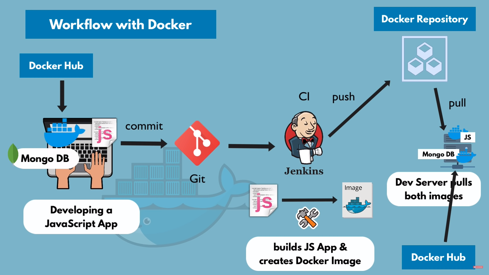
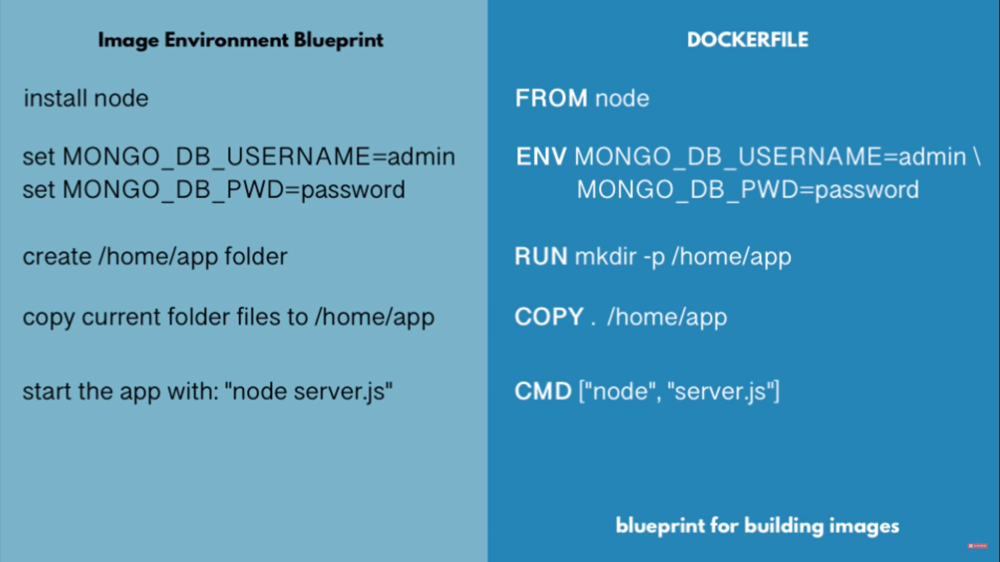
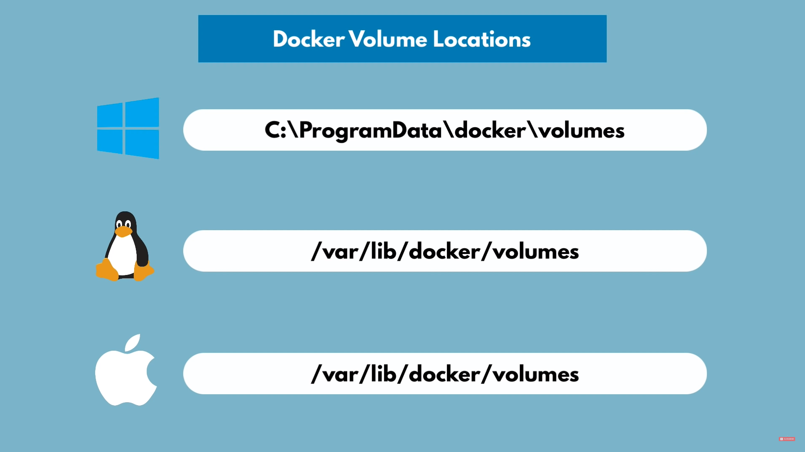

# Docker

## Container

- A way to package application with all the necessary dependencies and configuration
- Portable artifact, easily shared and moved around
- Makes development and deployment more efficient

## Docker Image vs Container

Image is the actual package. It is the artifact which can be moved around. When the image is run, container environment is created. Container is a running environment for image.

## Docker vs VM

VMs consist of two layers - OS kernel and application layer. However, Docker only consists of the application layer.

## Docker Commands

- **docker pull \<image>** - to pull an image from DockerHub
- **docker images** - list of images pulled
- **docker run \<image>** - start image in container, we can use the **--name** flag to set a custom name for the container
- **docker run -d \<image>** - start image in container in detatched mode
- **docker run -p6000:6379 \<image>** - to specify the port on the local machine
- **docker ps** - list running containers
- **docker stop \<contai\*ner_id>** - to stop a container
- **docker start \<container_id>** - to start a container
- **docker ps -a** - list running and stopped containers
- **docker logs \<container_id>** - check logs of a container
- **docker exec -it \<container_id> /bin/bash** - to navigate the file system of the container
- **docker rm \<container_id>** - delete a container
- **docker rmi \<image>** - delete an image



## Docker Compose

Running multiple services separately can be tedious. Using Docker compose, we can specify all the services and their configurations in a single file.

For example, for the following _docker run_ command -

```
// start mongodb
docker run -d \
--name mongodb \
-p 27017:27017 \
-e MONGO-INITDB_ROOT_USERNAME=admin \
-e MONGO-INITDB_ROOT_PASSWORD=password \
--net mongo-network \
mongo

// start mongo-express
docker run -d \
-p 8081:8081 \
-e ME_CONFIG_MONGODB_ADMINUSERNAME=admin \
-e ME_CONFIG_MONGODB_ADMINPASSWORD=password \
-e ME_CONFIG_MONGODB_SERVER=mongodb \
--net mongo-network \
--name mongo-express \
mongo-express
```

we can specify the following **\*mongo-docker-compose.yaml** file -

```
version: '3' //version of docker compose
services:
    mongodb:
        image: mongo
        ports:
         - 27017:27017
        environment:
         - MONGO-INITDB_ROOT_USERNAME=admin
         - MONGO-INITDB_ROOT_PASSWORD=password
    mongo-express:
        image: mongo-express
        ports:
         - 8081:8081
        environment:
         - ME_CONFIG_MONGODB_ADMINUSERNAME=admin
         - ME_CONFIG_MONGODB_ADMINPASSWORD=password
         - ME_CONFIG_MONGODB_SERVER=mongodb
```

We can add more services in a similar way.
We don't need to define network in docker compose because it takes care of creating a common network.

Command to start:

> docker-compose -f <yaml_file> up

Command to stop:

> docker-compose -f <yaml_file> down

## Dockerfile
A dockerfile is a blueprint for creating Docker images.


CMD is the entrypoint command.
You can have multiple **RUN** commands but just one **CMD** command.

The file name of a Dockerfile is **Dockerfile**.

Command to build image using this Dockerfile:
> docker build -t my-app:1.0

This command creates an image with name **my-app** and version **1.0**.

## Private Docker Repositoy
DockerHub is a public repository. We can store images of our applications by creating private repositories. For example, we can use AWS ECS to create a private repository and then store our application image in that repository using steps specified in AWS.

## Docker Volumes
Docker volumes are used for data persistence in Docker. A container has a virtual file system where data is stored. However, there is no persistence here. If we stop and restart a container, the data in the virtual file system is gone and it starts from a fresh state. This is not ideal if we use databases or other storage systems in our application. Docker Volumes persists data by mountung the physical host file system into the virtual file system of Docker.

```
version: '3' //version of docker compose
services:
    mongodb:
        image: mongo
        ports:
         - 27017:27017
        environment:
         - MONGO-INITDB_ROOT_USERNAME=admin
         - MONGO-INITDB_ROOT_PASSWORD=password
        volumes:
         - mongo-data:/data/db
    mongo-express:
        image: mongo-express
        ports:
         - 8081:8081
        environment:
         - ME_CONFIG_MONGODB_ADMINUSERNAME=admin
         - ME_CONFIG_MONGODB_ADMINPASSWORD=password
         - ME_CONFIG_MONGODB_SERVER=mongodb
volumes:
    mongo-data:
        driver: local
```
* **/data/db** is where mongo persists its data, this value will be different for different DBs
* **driver: local** gives additional information to Docker to create the physical storage on a local file system
* **mongo-data** is a custom volume name defined by us

