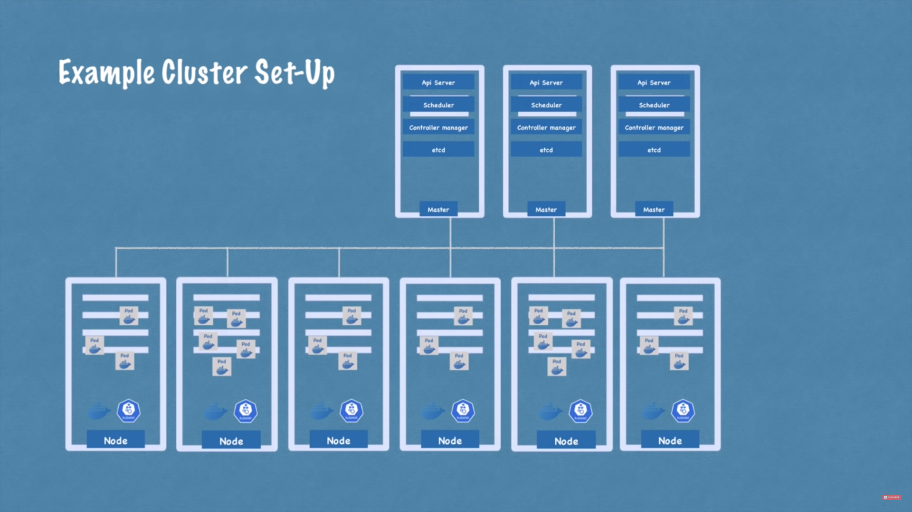

# Kubernetes

## Definition

- Open source _container orchestration tool_
- Developed by Google
- Helps you manage containerized applications in different deployment environments

## Kubernetes Components

1. **Pod**
- Smalled unit of k8s
- Abstraction over container
- Usually 1 application per pod
- Each pod gets its own IP address and pods can interact with each other using this IP address

2. **Service and Ingress**
- *Service* - A Kubernetes service is a logical abstraction for a deployed group of pods in a cluster (which all perform the same function). A service also acts as a load balancer. Whenever it receives a request, it forwards the request to the least busy pod.
- *Ingress* - Ingress is an object that allows access to your Kubernetes services from outside the Kubernetes cluster.

3. **Config Map and Secret**
- *Config Map* - Stores external configurations of your application
- *Secret* - Used to store secret data like username and password. Stored in base64 encoded format.

4. **Volumes**
- K8s does not manage data persistence
- Data is stored on local machine or remote, outside of the k8s cluster
- Think of the data storage as an external hard drive connected to a k8s cluster

5. **Stateful Sets**
- Stateful sets are meant for deployment of stateful apps like databases where consistency is important
- It takes care of replicating pods and scaling them up or down but it also makes sure the database writes and reads are synchronized

## Kubernetes Architecture

1. **Worker machine in K8s cluster**
- each Node has multiple Pods on it
- 3 processes must be installed on every Node - Kubelet, Kube Proxy and Container Runtime

2. **Master Nodes**
4 processes run on every master node:
- *API Server* - it's like a cluster gateway which gets the initial request to the cluster to perform a task like schedule or restart a pod. It acts as a gatekeeper for authentication.
- *Scheduler* - It decides on which worker node to schedule a new pod based on the available resources on the worker nodes.
- *Controller manager* - It detects state changes like crashing of pods and re-schedules the pods.
- *etcd* - It is the cluster brain. All the changes in the cluster get stored in the key value store.

