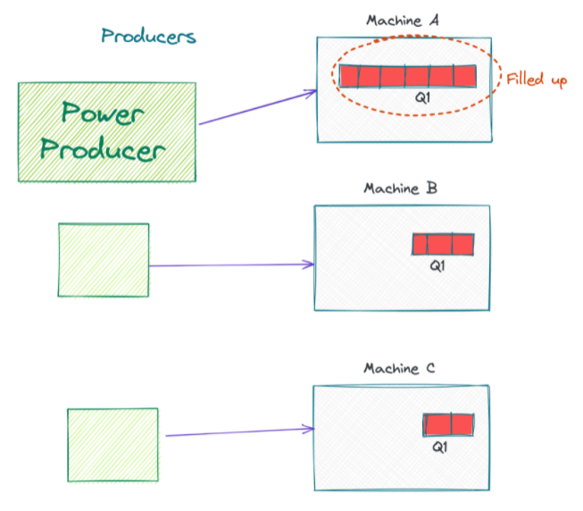

## Design a Distributed Messaging Queue - like RabbitMQ or Amazon SQS

### Requirements

- High Throughput
- The queue should have persistence as much as we can without compromising on high throughput
- Support for multiple consumers and producers
- Once an item is taken from queue, it can be deleted. Only one consumer can access one item.

### High Throughput Distributed Queue Scenario

Suppose we partition a queue to 3 machines through sharding. Producers can produce to a single partition and consumers can consume from a single partition. However, the issue with this design is that it is not strictly FIFO. It will only be FIFO within a single partition.

### How to keep the Distributed Queue evenly balanced?

Keeping the queue balanced means writing and reading evenly from all the machines. This can be achieved by using a balancing approach like a **coordinator**. We can have a **Queue Manager** that keeps track of the partitions.

When a producer needs to write to the Queue, it asks the Queue Manager for the IP address of a machine it can write to. Let’s say the Queue Manager returns the IP address of Machine C (where P3 is located). The Producer can now establish a persistent TCP/IP connection and start writing to P3.

Another solution is that the producer just passes the message to the Queue Manager and then the Queue Manager takes care of the rest. However, this solution is not efficient since the Manager is running only on one machine and thus it becomes a bottleneck as there's only so much throughput that a single machine can handle.

We also have heartbeat messages going from the Queue Manager to each partition, regularly communicating the partition’s health with the Queue Manager. If the partition goes down or becomes overcrowded in relation to the other partitions, the Queue manager can assign less producers to the partition.

However, one problem with this model is that it breaks down as soon as we have different producers producing different quantities of data.

One of the solutions for this issue is that each producer can write to different partitions in a round robin fashion. When the producer connects, the Queue manager can give it the IPs of all three partitions. The producer can then connect to all three machines and write to all 3 machines in a round robin fashion - once to Machine A, then to Machine B, then to C, and so on.

### How do we make sure the system is fault tolerant?

Replication.

Each partition has a leader machine and all the reads and writes to that partition go to that leader machine. The leader will write data to its partition and to all its synchronous replicas. Before sending acknowledgement to the producer, we make sure that the data is written in the minimum required of replicas.

We can also have asynchronous replicas which write to the replicas after that leader has sent an ack to the producer. This is faster for the throughput.

We can also use a combination of both.

After adding fault tolerance, this queueing system can now scale to many machines. We can auto scale the queue and add more partitions as load increases. To add another partition to a new machine, we simply create a new partition and point producers to it.
