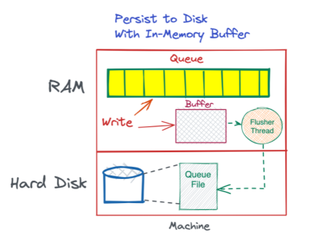

## Design a Messaging Queue with High Throughput (non-distributed)

This problem might seem trivial. After all, we just need to implement the Queue data structure. Indeed, if we initialize a queue in memory and read/write to it, it will be quite fast. However, the problem arises when we want to write to disk.


Moreover, suppose our machine goes down or restarts, we will lose the entire queue. RAM goes away if the computer restarts and this needs to be handled since failures in systems are very common.

There are 2 ways to deal with this:

1. **Persist the queue to disk** - even if the machine goes down, the queue can be reloaded from the hard drive.
2. **Replicate the queue across multiple machines** - if one machine goes down, the replica machine will still have the queue.

#### Queue on a Single Machine

If we were to implement a queue in our local IDE, we'd probably make a Queue object in Java.

```java
public class QueueManager<A> {
    Queue<A> queue = new Queue<>();

    // constructor
    // getter
    // setter
}
```

This makes an in-memory queue which lives in the program's Heap memory. Reads and writes are very fast.

So far, we have a single thread which does both reads and writes. To make this queue more efficient, we can have two threads - one for reads and the other for writes.


In reality, a single read/write operation can have multiple steps - logging, persisting to disk, etc. For these use cases, it makes sense to have separate threads for reading and writing so that a read thread does not have to wait while a write thread is doing those other operations.

### Multiple Queues on one machine

We can also have multiple queues in a single machine. For this, we can add a QueueManager that initializes different Queue objects and keeps track of each of them.

This Queue Manager can also maintain connections and serve as the interface to the queue. A client can send a request asking for an item in a particular queue - getItem(Q3), and the manager can call the Q3’s dequeue function and get the item and send it to the client.

Now, while this is a high-throughput system with fast read/write (since the queues are being stored in memory), there is one problem - persistence.

### Persistence

Adding persistence is a simple matter of backing up our queue to disk. We can write new data to an in-memory buffer and periodically flush the data to hard disk.

We are flushing the data periodically to reduce the number of writes to the disk, thus improving the load on our program.
A separate thread can be responsible for writing the content of the buffer to disk at every _flush interval_. Each queue can have its own file on disk.



### Queue Representation in the file

Every line in the file can be an item in the queue. Queue items can also be long lines or JSON. We can even use a simple to DB to persist the queues.

### How to make deletions faster?

Removing items from the start of the files can be expensive since we have to re-write the entire file. To remove items from the queue’s file, we can first add it to another file of dequeued items. We can periodically flush these items from the front of the file.

### Fault Tolerance

#### Scenario 1: Machine restarts or process crashes

Suppose the machine restarts and we lose the RAM, we still have the Queue persisted in file. However, at that moment, the data present in the buffer will be lost, which makes our Queue not completely reliable.

To improve the reliability, we can add replication. If we replicate this queue into another machine, then the small loss will be very unlikely to happen, because thge other machine's queue will still be up.

#### Scenario 2: Machine crashes along with hard disk

The above solution will work for this scenario as well. If we have a replica of the machine, then the data will be stored in the replica's hard disk.

If the data is extremely crucial, we can do a couple more things:

1. Increase replicas to 3 (this is the number used by Google File System).
2. Place replicas in different locations connected to different power supplies.

If the queue becomes too big for memory, we can move part of the queue to the disk to free up RAM space. This is similar to caching - swapping out lesser used pages to disk.
