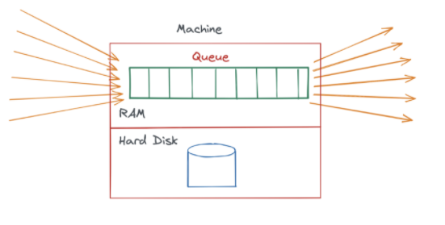
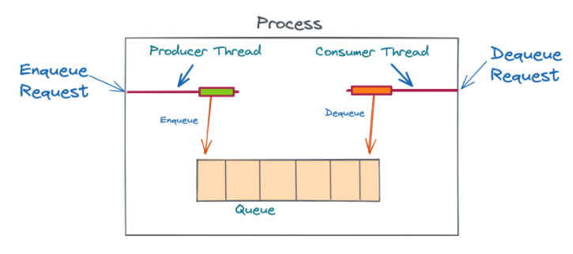

### Design a Messaging Queue with High Throughput (non-distributed)

This problem might seem trivial. After all, we just need to implement the Queue data structure. Indeed, if we initialize a queue in memory and read/write to it, it will be quite fast. However, the problem arises when we want to write to disk.



Moreover, suppose our machine goes down or restarts, we will lose the entire queue. RAM goes away if the computer restarts and this needs to be handled since failures in systems are very common.

There are 2 ways to deal with this:

1. **Persist the queue to disk** - even if the machine goes down, the queue can be reloaded from the hard drive.
2. **Replicate the queue across multiple machines** - if one machine goes down, the replica machine will still have the queue.

#### Queue on a Single Machine

If we were to implement a queue in our local IDE, we'd probably make a Queue object in Java.

```java
public class QueueManager<A> {
    Queue<A> queue = new Queue<>();

    // constructor
    // getter
    // setter
}
```

This makes an in-memory queue which lives in the program's Heap memory. Reads and writes are very fast.

So far, we have a single thread which does both reads and writes. To make this queue more efficient, we can have two threads - one for reads and the other for writes.



In reality, a single read/write operation can have multiple steps - logging, persisting to disk, etc. For these use cases, it makes sense to have separate threads for reading and writing so that a read thread does not have to wait while a write thread is doing those other operations.
